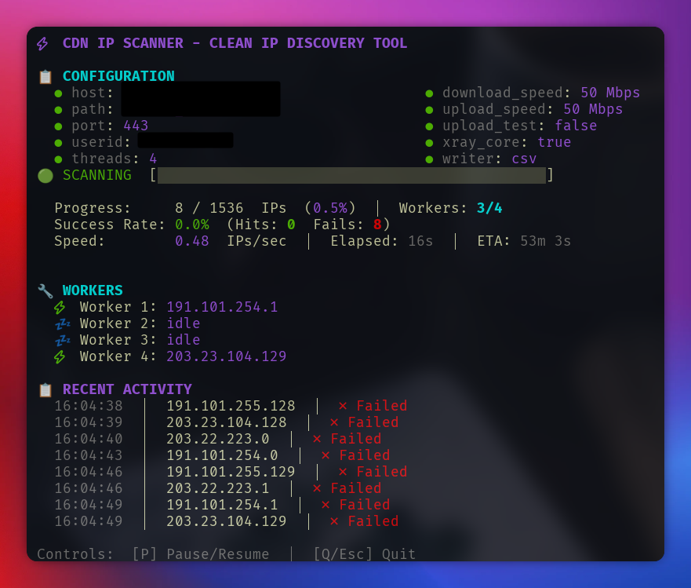

# CDN IP Scanner - Clean IP Discovery Tool

[](https://github.com/XTLS/Xray-core)
[](https://golang.org/)
[](LICENSE)

> **Universal CDN IP Scanner for finding clean and low latency IPs**

This is an enhanced fork of [CFScanner](https://github.com/MortezaBashsiz/CFScanner/tree/main/golang) with significant improvements for performance, usability, and modern transport protocols. While originally designed for Cloudflare, it works effectively with any CDN to discover clean IPs with low latency.

## What Makes This Fork Special

**Latest Xray-Core v26.2.6** - Updated to the newest version with all security patches and performance improvements

**Modern TUI Interface** - Clean terminal interface with real-time statistics, worker status, and interactive controls

**XHTTP (SplitHTTP) Optimized** - Specifically optimized for the latest XHTTP transport protocol for better CDN compatibility

**Multi-threading Enhanced** - Proper multi-worker support with individual worker tracking and pause/resume functionality

**Universal CDN Support** - Works with Cloudflare, Fastly, KeyCDN, and other major CDN providers to find clean IPs

## Features

- **Real-time TUI Dashboard** with live statistics
- **Multi-threaded scanning** with individual worker status
- **Pause/Resume functionality** with P key
- **XHTTP (SplitHTTP) transport** for optimal CDN bypass
- **Cross-platform builds** (Linux, Windows, macOS)
- **Clean configuration management** with automatic cleanup
- **Comprehensive logging** with success/failure tracking
- **Progress tracking** with ETA calculations
- **Universal CDN compatibility** for finding low latency IPs

## Usage

To see all available options:

```bash
./CFScanner -h
```

### Basic Examples

```bash
# Load configuration file and load subnet file for scanning
./CFScanner --config config.real --subnets ips.txt

# Load configuration file and use input cidr and begin scanning ips with 4 threads
./CFScanner --config config.real --subnets 172.20.0.0/24 --threads 4

# Load configurations file with subnet file and doing upload test
./CFScanner --config config.real --subnets 172.20.0.0/24 --threads 4 --upload

# Load configurations file with subnet file and testing each ip 3 times
./CFScanner --config config.real --subnets 172.20.0.0/24 --threads 4 --tries 3

# Load configurations file with subnet file and using vpn mode
./CFScanner --config config.real --subnets 172.20.0.0/24 --vpn
```

### Configuration

Create a `config.json` file:

```json
{
  "id": "your-uuid-here",
  "host": "your-server.example.com",
  "port": "443",
  "path": "/your-path",
  "serverName": "your-sni.example.com"
}
```

### TUI Controls

- **P** - Pause/Resume scanning
- **Q / Esc** - Quit scanner
- **Ctrl+C** - Force quit

## TUI Interface



The TUI provides real-time monitoring with:

- **Configuration Display** - Shows current settings in a compact format
- **Live Progress** - Real-time scanning progress with ETA calculations
- **Worker Status** - Individual worker threads with current IP being tested
- **Activity Log** - Recent scan results with success/failure indicators
- **Interactive Controls** - Pause/resume and quit functionality

## Build from Source

### Requirements

- Go 1.25.7 or later
- Git

### Dependencies

- **Xray-Core v26.2.6** - Latest version with XHTTP support
- **Bubble Tea** - Modern TUI framework
- **Lipgloss** - Terminal styling
- **Cobra** - CLI framework

### Build Process

```bash
# Clone repository
git clone https://github.com/ArchNets/CDN-IP-Scanner.git
cd CDN-IP-Scanner

# Install dependencies
go mod tidy

# Build with optimization
go build -o cfscanner -trimpath -ldflags "-s -w -buildid=" .

# Cross-platform builds
GOOS=windows GOARCH=amd64 go build -o cfscanner-windows.exe -trimpath -ldflags "-s -w -buildid=" .
GOOS=darwin GOARCH=amd64 go build -o cfscanner-macos-intel -trimpath -ldflags "-s -w -buildid=" .
GOOS=darwin GOARCH=arm64 go build -o cfscanner-macos-arm64 -trimpath -ldflags "-s -w -buildid=" .

# Run
./cfscanner -h
```

## Key Improvements Over Original

1. **Modern Transport Protocols**
   - XHTTP (SplitHTTP) as default transport
   - Better CDN compatibility and detection resistance

2. **Enhanced User Experience**
   - Clean TUI with real-time updates
   - Individual worker status tracking
   - Interactive pause/resume functionality

3. **Performance Optimizations**
   - Efficient multi-threading without race conditions
   - Optimized configuration file management
   - Reduced memory footprint

4. **Code Quality**
   - Clean, maintainable codebase
   - Proper error handling
   - Comprehensive logging

## CDN Compatibility

This scanner works effectively with major CDN providers:

- **Cloudflare** - Original target, fully tested
- **Fastly** - Compatible with XHTTP transport
- **KeyCDN** - Works with standard configurations
- **AWS CloudFront** - Supports clean IP discovery
- **Azure CDN** - Compatible with low latency scanning
- **Google Cloud CDN** - Works with proper configuration

## Contributing

We welcome contributions! Please:

1. Fork the repository
2. Create a feature branch
3. Make your changes
4. Add tests if applicable
5. Submit a pull request

## License

This project is licensed under the GPL-3.0 License - see the [LICENSE](LICENSE) file for details.

## Credits

- **Original Project**: [CFScanner](https://github.com/MortezaBashsiz/CFScanner) by MortezaBashsiz
- **Enhanced Fork**: Developed and maintained by **Arch Net Team**
- **Xray-Core**: [XTLS Project](https://github.com/XTLS/Xray-core)

## Links

- [Original CFScanner](https://github.com/MortezaBashsiz/CFScanner/tree/main/golang)
- [Xray-Core Documentation](https://xtls.github.io/)
- [Transport Examples](vpn/TRANSPORT_EXAMPLES.md)

---

**Note**: This scanner is designed to find clean IPs with low latency across various CDN providers. Always ensure you comply with the terms of service of the services you're testing.
